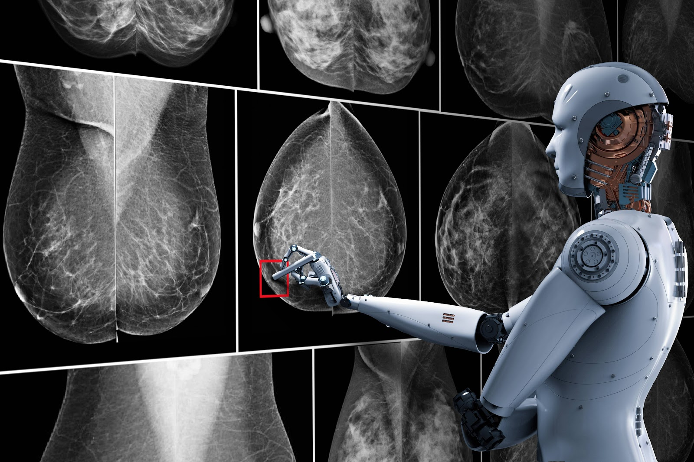

# Building a Simple Machine Learning Model on Breast Cancer Wisconsin (Diagnostic) Data :- 

## Introduction :- 
Breast cancer (BC) is one of the most common cancers among women worldwide, representing the majority of new cancer cases and cancer-related deaths according to global statistics, making it a significant public health problem in today’s society.

The early diagnosis of BC can improve the prognosis and chance of survival significantly, as it can promote timely clinical treatment to patients. Further accurate classification of benign tumors can prevent patients undergoing unnecessary treatments. Thus, the correct diagnosis of BC and classification of patients into malignant or benign groups is the subject of much research. Because of its unique advantages in critical features detection from complex BC datasets, machine learning (ML) is widely recognized as the methodology of choice in BC pattern classification and forecast modelling.

Classification and data mining methods are an effective way to classify data. Especially in medical field, where those methods are widely used in diagnosis and analysis to make decisions.

## Recommended Screening Guidelines:-
**Mammography:** The most important screening test for breast cancer is the mammogram. A mammogram is an X-ray of the **breast :** It can detect breast cancer up to two years before the tumor can be felt by you or your doctor.

**Women :** age 40–45 or older who are at average risk of breast cancer should have a mammogram once a year.

**Women at high risk :** should have yearly mammograms along with an MRI starting at age 30.

## Some Risk Factors for Breast Cancer :- 
**The following are some of the known risk factors for breast cancer.** However, most cases of breast cancer cannot be linked to a specific cause. Talk to your doctor about your specific risk.

**Age :** The chance of getting breast cancer increases as women age. Nearly 80 percent of breast cancers are found in women over the age of 50.

**Personal history of breast cancer :** A woman who has had breast cancer in one breast is at an increased risk of developing cancer in her other breast.

**Family history of breast cancer :** A woman has a higher risk of breast cancer if her mother, sister or daughter had breast cancer, especially at a young age (before 40). Having other relatives with breast cancer may also raise the risk.

**Genetic factors :** Women with certain genetic mutations, including changes to the BRCA1 and BRCA2 genes, are at higher risk of developing breast cancer during their lifetime. Other gene changes may raise breast cancer risk as well.

**Childbearing and menstrual history :** The older a woman is when she has her first child, the greater her risk of breast cancer. Also at higher risk are:

**Women who menstruate for the first time at an early age (before 12)**

**Women who go through menopause late (after age 55)**

**Women who’ve never had children**

## Objectives :- 
_ This analysis aims to observe which features are most helpful in predicting malignant or benign cancer and to see general trends that may aid us in model selection and hyper parameter selection. The goal is to classify whether the breast cancer is benign or malignant. To achieve this i have used machine learning classification methods to fit a function that can predict the discrete class of new input.

## Steps of my solution :- 

**1_ Business Understanding / Problem Statement**

**2_ Data studying**

**3_ Data Collection** 

**4_Data Cleaning**

**5_Data Exploration & Analysis (EDA)**

**6_Data Modelling**
